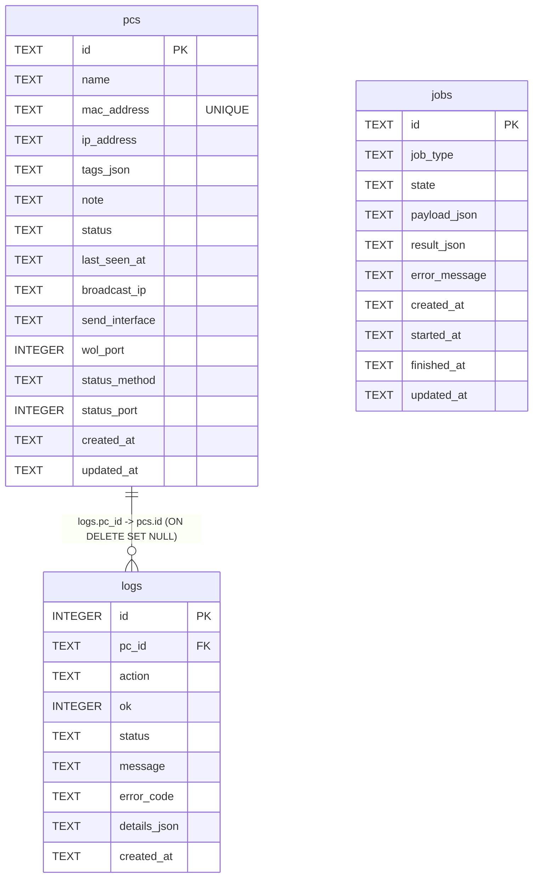

# Backend DB Schema (SQLite)

## 目的

- バックエンドのDBスキーマを、実装と同じ粒度で可視化する。
- API/サービス変更時に、どのテーブル・カラムへ影響するかを即座に確認できるようにする。

## 変更内容

- 2026-02-24: 現行スキーマ（`pcs` / `logs` / `jobs`）のER図を追加。
- `pcs.mac_address` は `UNIQUE INDEX (uq_pcs_mac_address)` で重複不可。

## ER図

## 運用時の注意点

- `pcs.mac_address` は起動時マイグレーションで正規化される（`AA:BB:CC:DD:EE:FF` 形式）。
- 既存データに同一MACの重複があると、一意制約作成時に起動エラーになる。重複解消後に再起動する。
- スキーマ変更時は、このページと `docs/backend/api/openapi.md` を同時更新する。
