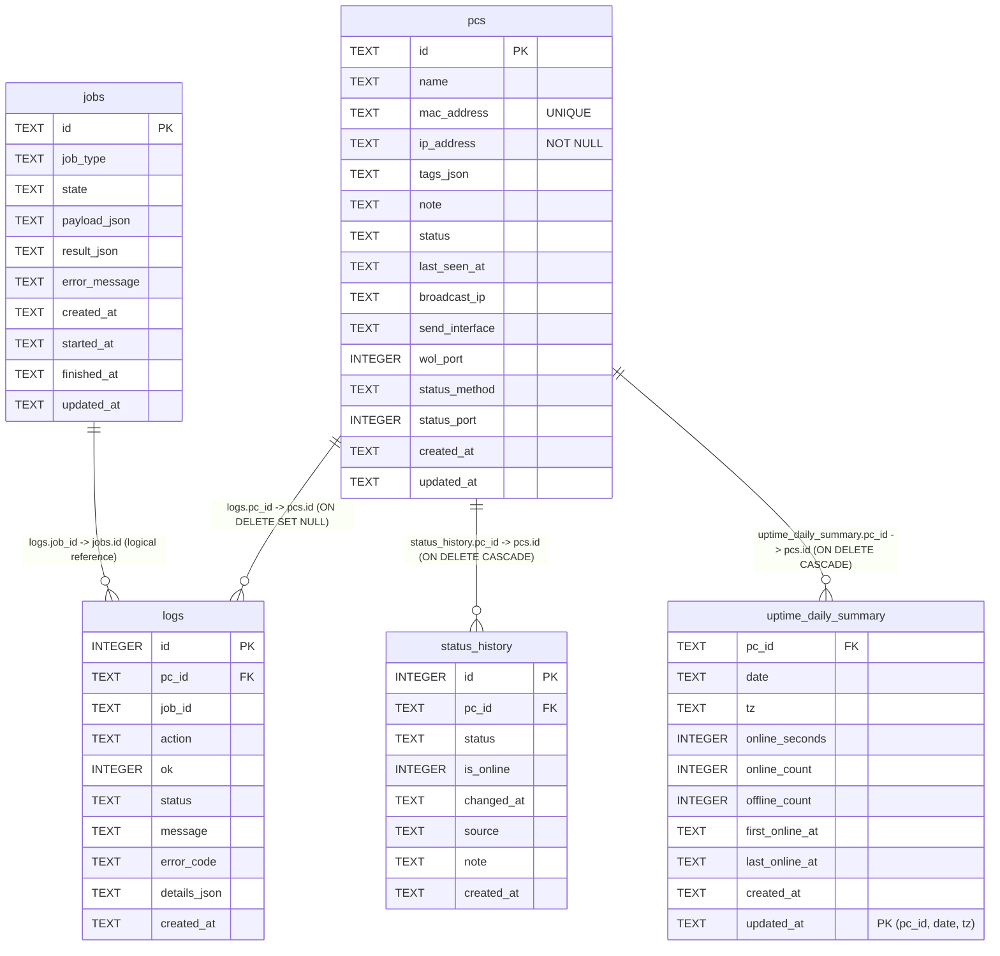

# Backend DB Schema (SQLite)

## 目的

- バックエンドのDBスキーマを、実装と同じ粒度で可視化する。
- API/サービス変更時に、どのテーブル・カラムへ影響するかを即座に確認できるようにする。

## 変更内容

- 2026-03-01: Alembic/SQLiteの実DDLに合わせてインデックス記述を更新（`DESC` 明記を削除）。
- 2026-03-01: uptime詳細メモを `docs/backend/db/uptime-tables.md` へ集約（本ページは全体ER中心に整理）。
- 2026-02-27: 実クエリに合わせてインデックスを再設計（`logs/jobs/status_history/uptime_daily_summary`）。
- 2026-02-27: ER図を `ER図（全体）` 1つに統合。
- 2026-02-24: 現行スキーマ（`pcs` / `logs` / `jobs`）のER図を追加。
- `pcs.mac_address` は `UNIQUE INDEX (uq_pcs_mac_address)` で重複不可。
- 2026-02-25: uptime機能向けに `status_history` / `uptime_daily_summary` を追加。

## ER図（全体）

## 実クエリ整合インデックス（主要）

- `pcs`
  - `idx_pcs_status_id (status, id ASC)`: statusフィルタ + カーソルページング
- `logs`
  - `idx_logs_pc_id_desc (pc_id, id)`: `pc_id` 絞り込み + 新しい順（逆順走査）
  - `idx_logs_action_id_desc (action, id)`: `action` 絞り込み + 新しい順（逆順走査）
  - `idx_logs_ok_id_desc (ok, id)`: 成否絞り込み + 新しい順（逆順走査）
  - `idx_logs_job_id_id_desc (job_id, id)`: `job_id` 単位のログ取得 + 新しい順（逆順走査）
  - `idx_logs_created_at (created_at)`: 保持期間削除、`since/until` 範囲条件
- `jobs`
  - `idx_jobs_job_type_state_created_at (job_type, state, created_at)`: 同種ジョブの `queued/running` 最新取得

## 運用時の注意点

- `pcs.mac_address` は起動時マイグレーションで正規化される（`AA:BB:CC:DD:EE:FF` 形式）。
- `pcs.ip_address` は必須（`NOT NULL`）。`NULL/空文字` 行がある状態では `3f2a6df9d4a1` マイグレーションが失敗するため、事前に補正または削除が必要。
- 既存データに同一MACの重複があると、一意制約作成時に起動エラーになる。重複解消後に再起動する。
- 保持期間方針:
  - `status_history`: 1年保持（定期削除）。
  - `uptime_daily_summary`: 無期限保持。
- スキーマ変更時は、このページと `docs/backend/api/openapi.md` を同時更新する。
