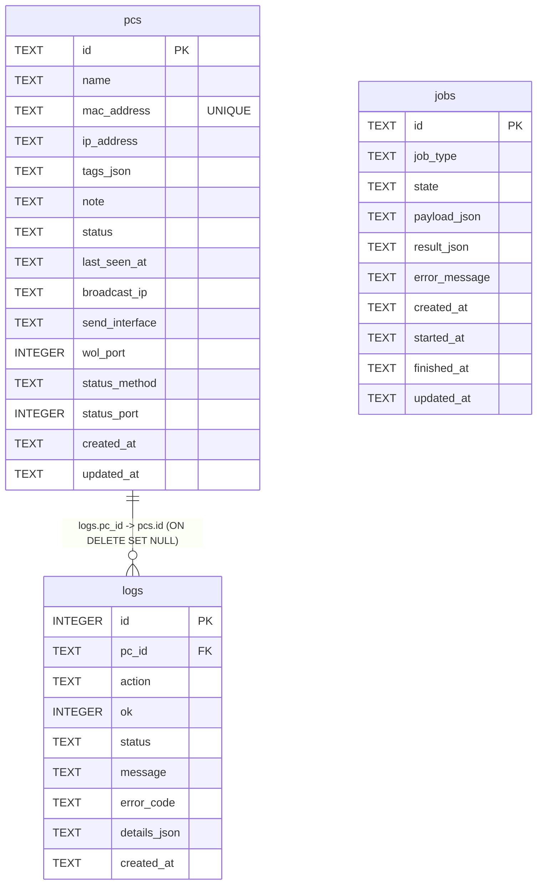
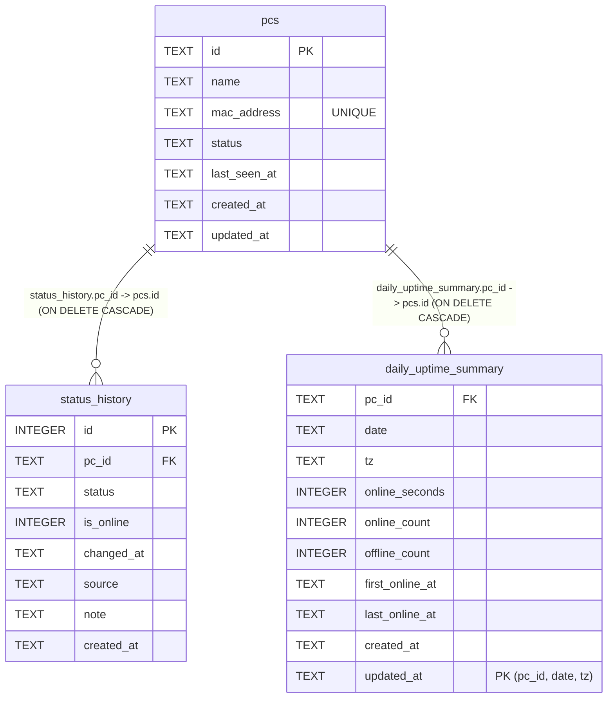

# Backend DB Schema (SQLite)

## 目的

- バックエンドのDBスキーマを、実装と同じ粒度で可視化する。
- API/サービス変更時に、どのテーブル・カラムへ影響するかを即座に確認できるようにする。

## 変更内容

- 2026-02-24: 現行スキーマ（`pcs` / `logs` / `jobs`）のER図を追加。
- `pcs.mac_address` は `UNIQUE INDEX (uq_pcs_mac_address)` で重複不可。
- 2026-02-25: uptime機能向けに `status_history` / `daily_uptime_summary` の設計案を追加（未実装）。

## ER図（現行）

## ER図（uptime追加設計案 / 未実装）

## 追加テーブル設計メモ（uptime）

- `status_history`
  - 用途: 状態変化イベントを時系列保存し、週タイムラインの区間生成に使う。
  - 保存ルール: 前回状態から変化したときのみ1レコード追加。
  - `is_online`: `status == online` のとき `1`、それ以外は `0`。
  - 推奨インデックス:
    - `idx_status_history_pc_changed_at (pc_id, changed_at DESC)`
    - `idx_status_history_changed_at (changed_at DESC)`

- `daily_uptime_summary`
  - 用途: 日次グラフ表示向けの集計結果を保持。
  - 1日1PC1行（`pc_id + date + tz` を主キー）。
  - `online_seconds` は 0..86400。`online_ratio` はAPIで算出して返却。
  - 推奨インデックス:
    - `idx_daily_uptime_date (date DESC)`

## 運用時の注意点

- `pcs.mac_address` は起動時マイグレーションで正規化される（`AA:BB:CC:DD:EE:FF` 形式）。
- 既存データに同一MACの重複があると、一意制約作成時に起動エラーになる。重複解消後に再起動する。
- 保持期間方針:
  - `status_history`: 1年保持（定期削除）。
  - `daily_uptime_summary`: 無期限保持。
- スキーマ変更時は、このページと `docs/backend/api/openapi.md` を同時更新する。
